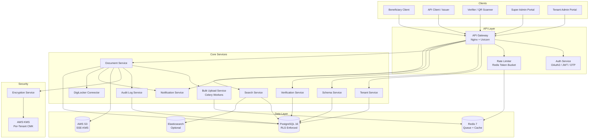
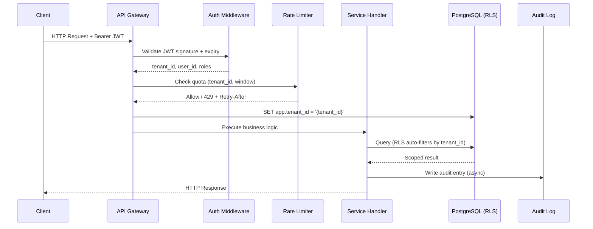
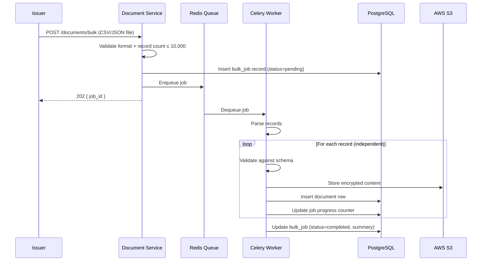
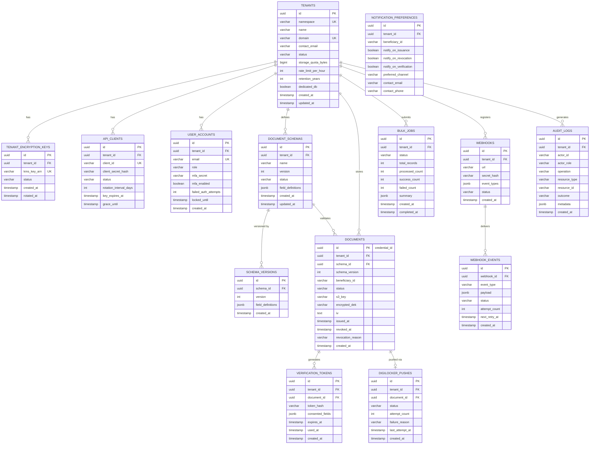

# Design Document

## Generic Multi-Tenant SaaS Document and Credential Repository Platform

---

## Overview

This platform is a domain-agnostic, extensible digital credential depository inspired by India's National Academic Depository (NAD). It enables any government department, private organization, or regulatory body (a "Tenant") to onboard as an issuer, define custom document schemas, upload structured credential records for beneficiaries, and make those credentials available for secure access and third-party verification.

**Core capabilities:**
- Multi-tenant architecture with strict namespace isolation (logical via PostgreSQL RLS, optional physical DB isolation for enterprise tenants)
- Per-tenant encryption key management via AWS KMS using envelope encryption
- Flexible document schema versioning and validation engine
- Async bulk upload pipeline (job-based, CSV/JSON, up to 10,000 records per batch)
- Verification token flow (single-use, time-limited, QR-code embedded)
- REST API with OAuth 2.0 / JWT, per-tenant rate limiting, webhook delivery
- Optional DigiLocker connector (async push with retry)
- Immutable append-only audit log
- Per-tenant search index (PostgreSQL `pg_trgm` + GIN indexes, with optional Elasticsearch for large tenants)
- RBAC with MFA for admin roles
- Notification service (email/SMS via pluggable provider)

**Technology stack:**
- **Backend:** Python 3.12 / FastAPI
- **Primary DB:** PostgreSQL 16 with Row-Level Security (RLS)
- **Cache / Rate Limiting:** Redis 7
- **Job Queue:** Redis + Celery (async bulk processing)
- **Object Storage:** AWS S3 (encrypted at rest with SSE-KMS)
- **Key Management:** AWS KMS (one Customer Managed Key per tenant namespace)
- **Search:** PostgreSQL `pg_trgm` + GIN indexes (default); Elasticsearch as optional upgrade for tenants > 100k documents
- **Document Signing:** Python `reportlab` / `weasyprint` for PDF, `PyLD` for JSON-LD
- **QR Codes:** `qrcode` library embedded in signed output
- **Notifications:** Pluggable adapter (AWS SES for email, AWS SNS for SMS)
- **API Gateway:** AWS API Gateway or Nginx + Gunicorn/Uvicorn
- **Deployment:** Docker containers orchestrated via Kubernetes (EKS)


---

## Architecture

### High-Level Architecture Diagram



### Multi-Tenancy Model

The platform uses a **hybrid multi-tenancy approach**:

| Tier | Model | When Used |
|------|-------|-----------|
| Standard | Shared DB + Shared Schema + PostgreSQL RLS | Default for all tenants |
| Enterprise | Shared DB + Per-tenant Schema | Tenants requiring schema-level isolation |
| Dedicated | Physically isolated PostgreSQL instance | Enterprise contracts, compliance mandates |

**PostgreSQL RLS** is the primary isolation mechanism. Every table carrying tenant data has a `tenant_id UUID NOT NULL` column and a policy:

```sql
CREATE POLICY tenant_isolation ON documents
  USING (tenant_id = current_setting('app.tenant_id')::uuid);
```

The application sets `app.tenant_id` at the start of every transaction via a FastAPI middleware that extracts the tenant ID from the validated JWT. This ensures isolation is enforced at the database level — below the application, below the ORM.

### Request Lifecycle




---

## Components and Interfaces

### 1. Auth Service

Handles all authentication flows: OAuth 2.0 client credentials (for API clients), OTP-based (for beneficiaries), and MFA (for tenant_admin / super_admin).

**Key interfaces:**

```
POST /api/v1/auth/token
  Body: { grant_type, client_id, client_secret }
  Response: { access_token, token_type, expires_in }  (expires_in ≤ 3600)

POST /api/v1/auth/otp/request
  Body: { contact: "email|phone", identifier }
  Response: { otp_id, expires_in: 600 }

POST /api/v1/auth/otp/verify
  Body: { otp_id, code }
  Response: { access_token, token_type, expires_in }

POST /api/v1/auth/mfa/challenge
POST /api/v1/auth/mfa/verify
```

**Design decisions:**
- JWTs are signed with RS256 (RSA private key per environment), making them verifiable without a DB lookup on hot paths.
- OTP codes are 6-digit TOTP-style codes, stored as bcrypt hashes in Redis with a 10-minute TTL.
- MFA uses TOTP (RFC 6238) via an authenticator app. Admin accounts require MFA enrollment before first login.
- Account lockout state is stored in Redis with a 15-minute TTL (or 30-minute for MFA lockout).

### 2. Tenant Service

Manages tenant lifecycle, quota, and namespace provisioning.

**Key interfaces:**

```
POST   /api/v1/admin/tenants          (Super_Admin)
GET    /api/v1/admin/tenants/{id}     (Super_Admin)
PATCH  /api/v1/admin/tenants/{id}     (Super_Admin) — lifecycle, quota, rate limit
DELETE /api/v1/admin/tenants/{id}     (Super_Admin) — triggers deactivation flow
GET    /api/v1/tenants/me             (Tenant_Admin) — own tenant info
```

**Provisioning flow (async, completes within 60s):**
1. Validate uniqueness of domain across all lifecycle states.
2. Insert tenant record in `pending` state.
3. Call AWS KMS `CreateKey` — store ARN in `tenant_encryption_keys` table.
4. Create RLS policy binding for the new `tenant_id`.
5. If dedicated DB requested: provision RDS instance via IaC module.
6. Generate API client credentials (client_id / client_secret, bcrypt-hashed secret stored in DB).
7. Transition tenant to `pending`, return credentials. Super_Admin approval transitions to `active`.

### 3. Schema Service

Manages per-tenant document schema definitions with full version history.

**Key interfaces:**

```
POST   /api/v1/schemas                (Tenant_Admin)
GET    /api/v1/schemas/{id}           (Tenant_Admin, Issuer)
GET    /api/v1/schemas/{id}/versions  (Tenant_Admin)
PATCH  /api/v1/schemas/{id}           (Tenant_Admin) — version bump if valid
DELETE /api/v1/schemas/{id}           (Tenant_Admin) — deactivates schema
GET    /api/v1/schemas/{id}/export    (Tenant_Admin) — JSON export
```

**Schema validation logic:**
- Each field definition must include: `name` (non-empty string), `type` (enum: string|number|date|boolean|enumeration|file_reference), `required` (boolean).
- Enumeration fields must include `allowed_values: string[]` (non-empty).
- On update: the service queries all documents under the current schema version and runs a dry-run validation pass. If any document would fail under the new field definitions, the update is rejected with the list of conflicting `credential_id`s.
- Version numbers are monotonically increasing integers managed by the service layer (not by the DB sequence) to guarantee `new_version = old_version + 1`.

### 4. Document Service

Core service for single-document and bulk upload, retrieval, and revocation.

**Key interfaces:**

```
POST   /api/v1/documents              (Issuer) — single upload
GET    /api/v1/documents              (Issuer, Tenant_Admin) — search/list
GET    /api/v1/documents/{id}         (Beneficiary, Issuer, Tenant_Admin)
GET    /api/v1/documents/{id}/download (Beneficiary) — signed PDF or JSON-LD
POST   /api/v1/documents/{id}/revoke  (Issuer)
POST   /api/v1/documents/bulk         (Issuer) — bulk upload → 202 + job_id
GET    /api/v1/documents/bulk/{job_id} (Issuer) — job status + progress

POST   /api/v1/documents/bulk-revoke  (Issuer) — up to 1,000 IDs
```

**Single upload flow:**
1. Validate JWT and extract `tenant_id`.
2. Validate `schema_id` exists, belongs to tenant, and is active.
3. Validate payload fields against schema (type-check, required fields, enum values).
4. Validate `beneficiary_id` is non-empty.
5. Encrypt document content via Encryption Service (AES-256 envelope encryption).
6. Store encrypted payload to S3 (`s3://{tenant_id}/{credential_id}`).
7. Insert document metadata row into PostgreSQL.
8. Write audit log entry (async task, must complete within 5s).
9. Trigger search index update (async, within 5s).
10. If DigiLocker connector enabled: enqueue push task.
11. If notifications enabled: enqueue notification task.
12. Return `{ credential_id, status: "stored" }`.

**Bulk upload flow:**
1. Accept CSV/JSON file ≤ 10,000 records. Reject > 10,000 or unsupported format immediately (before processing).
2. Return HTTP 202 with `job_id` within 5 seconds.
3. Celery worker processes records independently: validates each against schema, encrypts, stores, assigns credential_id.
4. Writes per-record results to job state (Redis hash).
5. On completion: writes final summary to PostgreSQL `bulk_jobs` table.


### 5. Verification Service

Manages verification token lifecycle and the public verification API.

**Key interfaces:**

```
POST /api/v1/verifications/tokens          (Beneficiary) — generate token
GET  /api/v1/verifications/{token}         (Verifier) — consume token
GET  /api/v1/verify/{credential_id}        (Public, unauthenticated) — validity status only
GET  /api/v1/verify/qr/{token}             (Public) — QR landing page
```

**Token generation flow:**
1. Beneficiary authenticates, specifies `credential_id` and `consented_fields: string[]` and optional `expiry_hours` (1–168, default 72).
2. Service validates credential belongs to this beneficiary.
3. Generates a cryptographically random 32-byte token string (URL-safe base64).
4. Stores in `verification_tokens` table: `token_hash` (SHA-256), `credential_id`, `consented_fields`, `expires_at`, `used_at = null`.
5. Returns token + expiry to beneficiary (for embedding in QR code).

**Token consumption flow:**
1. Verifier submits token.
2. Service computes SHA-256 of submitted token, looks up `token_hash`.
3. Check: not found → `token-invalid`. `used_at IS NOT NULL` → `token-already-used`. `expires_at < now()` → `token-expired`.
4. Mark `used_at = now()` atomically.
5. Return: `{ valid: true, issuer_name, issued_at, fields: { only consented_fields } }`.
6. Write audit log entry.

**Design decision:** Storing the hash of the token (not the token itself) means a DB breach does not expose redeemable tokens — similar to the password hashing pattern.

### 6. Encryption Service

Wrapper around AWS KMS implementing per-tenant envelope encryption.

**Envelope encryption pattern** (sourced from [AWS documentation](https://docs.aws.amazon.com/wellarchitected/latest/financial-services-industry-lens/use-envelope-encryption-with-customer-master-keys.html)):
- Each tenant has one AWS KMS Customer Managed Key (CMK).
- Per document: generate a unique 256-bit Data Encryption Key (DEK) locally.
- Encrypt the document content with DEK using AES-256-GCM.
- Encrypt the DEK with the tenant's CMK via KMS `Encrypt` API.
- Store `{ encrypted_dek, ciphertext }` in S3. The CMK never leaves KMS.

This means KMS is called once per upload (not once per byte), keeping costs and latency low.

```
interface EncryptionService:
    encrypt(tenant_id: UUID, plaintext: bytes) -> EncryptedPayload
    decrypt(tenant_id: UUID, payload: EncryptedPayload) -> bytes

dataclass EncryptedPayload:
    encrypted_dek: bytes   # KMS-encrypted DEK
    iv: bytes              # AES-GCM initialization vector
    ciphertext: bytes      # AES-256-GCM ciphertext
    tenant_cmk_arn: str    # For audit and key rotation tracking
```

### 7. Audit Log Service

Append-only event store. No UPDATE or DELETE operations are permitted at the application or database layer.

**Design decisions:**
- Audit entries are written to a dedicated `audit_logs` table with a PostgreSQL `BEFORE UPDATE OR DELETE` trigger that raises an exception — immutability enforced at the DB level.
- Writes are performed asynchronously via a Celery task but the originating operation is rolled back if the audit write fails (transactional outbox pattern using the same PostgreSQL transaction).
- Partition the table by month to keep query performance acceptable over 7–99 year retention windows.

```
interface AuditLogService:
    record(entry: AuditEntry) -> None  # async, raises on failure

dataclass AuditEntry:
    id: UUID
    tenant_id: UUID
    actor_id: str           # user_id or api_client_id
    actor_role: str
    operation: str          # CREATE_DOCUMENT, VERIFY_TOKEN, etc.
    resource_type: str
    resource_id: str
    outcome: str            # success | failure_reason
    metadata: dict          # operation-specific context
    created_at: datetime    # UTC, set by DB default
```

### 8. Search Service

Per-tenant document metadata search built on PostgreSQL `pg_trgm` and GIN indexes for full-text search on metadata fields. Elasticsearch is an optional upgrade tier for tenants with > 100,000 documents.

**Key interfaces:**

```
GET /api/v1/documents?q={query}&schema_type={}&status={}&issued_after={}&issued_before={}&sort_by={}&sort_order={}&page={}&page_size={}
```

**Design decisions:**
- `pg_trgm` GIN index on `beneficiary_id`, `schema_type`, and a tsvector column on searchable metadata fields covers the primary search use cases without adding an external dependency for standard tenants.
- Search results always carry the RLS `tenant_id` filter, making cross-tenant leakage impossible at the DB level.
- Index is updated synchronously within the same transaction as document insert/update. The 5-second SLA is thus guaranteed by the DB write path.

### 9. Notification Service

Event-driven notification delivery over email (AWS SES) and SMS (AWS SNS).

**Retry policy:** Up to 3 retries with exponential backoff (30s, 60s, 120s) implemented as Celery `retry` with `countdown` and `max_retries=3`. Final status (delivered/failed) written to `notification_log` table and audit log.

**Opt-out enforcement:** Before sending, service checks `beneficiary_notification_preferences` table. If disabled or no contact on file: skip + log `skipped-notification` audit entry.

### 10. Bulk Upload Pipeline



### 11. DigiLocker Connector

Async push via Celery beat scheduler. The connector implements DigiLocker's issuer API (OAuth 2.0 authorization code flow for the issuer account). Each push attempt is logged in the audit log.

**Retry policy:** 5 retries at minimum 60-second intervals (`countdown=60, max_retries=5`). On exhaustion: mark `digilocker_pushes.status = 'permanently_failed'`, notify tenant_admin, write audit entry. No-account case fails immediately without retry.

### 12. Webhook Service

Per-tenant webhook registry. On qualifying events (document uploaded, revoked, verified), the service:
1. Looks up all active webhooks for the tenant.
2. Serializes the event payload as JSON.
3. Computes `HMAC-SHA256(webhook_secret, payload_bytes)` and delivers in `X-Webhook-Signature` header.
4. Retries on non-2xx: first retry 5–10s after failure, subsequent retries double the interval (max 3 retries).
5. Marks undelivered events in `webhook_events` table and surfaces in Tenant_Admin dashboard.


---

## Data Models

### Entity Relationship Diagram



### Key Schema Notes

**`DOCUMENTS` table encryption:**
- `s3_key`: path to the encrypted content in S3.
- `encrypted_dek`: the KMS-encrypted Data Encryption Key (base64).
- `iv`: AES-GCM initialization vector (base64).
- Raw document fields are stored encrypted in S3, not in PostgreSQL. PostgreSQL only stores searchable metadata fields and the DEK.

**`AUDIT_LOGS` immutability:**
```sql
CREATE OR REPLACE FUNCTION prevent_audit_modification()
RETURNS trigger AS $$
BEGIN
  RAISE EXCEPTION 'Audit log entries are immutable';
END;
$$ LANGUAGE plpgsql;

CREATE TRIGGER audit_immutable
  BEFORE UPDATE OR DELETE ON audit_logs
  FOR EACH ROW EXECUTE FUNCTION prevent_audit_modification();
```

**`DOCUMENT_SCHEMAS` version management:**
- The `field_definitions` JSONB column stores the current version's definition.
- Every accepted update inserts a row into `SCHEMA_VERSIONS` first (capturing the old version), then increments `version` in `DOCUMENT_SCHEMAS`. Rollback if either step fails.

**RLS policies (example):**
```sql
ALTER TABLE documents ENABLE ROW LEVEL SECURITY;
ALTER TABLE documents FORCE ROW LEVEL SECURITY;

CREATE POLICY tenant_isolation ON documents
  USING (tenant_id = current_setting('app.tenant_id')::uuid)
  WITH CHECK (tenant_id = current_setting('app.tenant_id')::uuid);
```
Same pattern applies to: `document_schemas`, `schema_versions`, `verification_tokens`, `audit_logs`, `webhooks`, `webhook_events`, `bulk_jobs`, `notification_preferences`, `digilocker_pushes`.

**Storage quota tracking:**
- A `tenant_storage_usage` materialized view (refreshed on each document insert/delete) tracks current bytes per tenant.
- A PostgreSQL function `check_quota_before_insert()` is called as a `BEFORE INSERT` trigger on `documents` to enforce the quota limit.


---

## Correctness Properties

*A property is a characteristic or behavior that should hold true across all valid executions of a system — essentially, a formal statement about what the system should do. Properties serve as the bridge between human-readable specifications and machine-verifiable correctness guarantees.*

This feature is well-suited for property-based testing in its pure-logic layers: namespace isolation invariants, schema validation, token state machines, RBAC enforcement, and data transformation functions. Infrastructure integration points (KMS calls, S3, SES, DigiLocker API) are tested with integration tests and mocks. Property tests use **[Hypothesis](https://hypothesis.readthedocs.io/)** (Python's leading property-based testing library), configured to run a minimum of 100 examples per property.

---

### Property 1: Tenant Namespace Global Uniqueness

*For any* set of N successfully registered tenants, the set of assigned `tenant_namespace` values has cardinality N — no two tenants share a namespace.

**Validates: Requirements 1.1, 1.3**

---

### Property 2: Deactivated Tenant Write Rejection

*For any* tenant in `deactivated` state, every write operation (document upload, schema creation, bulk upload submission) returns an error, while read operations (document retrieval, audit log query) succeed.

**Validates: Requirements 1.6**

---

### Property 3: Quota Enforcement — All Uploads Rejected at Quota

*For any* tenant whose current storage usage equals or exceeds its configured quota, every subsequent document upload attempt returns a quota-exceeded error and leaves the document count unchanged.

**Validates: Requirements 1.8, 3.7**

---

### Property 4: Rate Limit — HTTP 429 with Retry-After at Limit

*For any* tenant that has exhausted its configured request quota within the rolling window, every subsequent request returns HTTP 429 with a `Retry-After` header specifying a positive number of seconds.

**Validates: Requirements 1.9, 8.4**

---

### Property 5: Schema CRUD Namespace Isolation

*For any* two distinct tenant namespaces A and B, an authenticated operation from namespace A that targets a schema belonging to namespace B always returns an authorization error without modifying any data.

**Validates: Requirements 2.1, 7.1, 7.2**

---

### Property 6: Schema Field Validation Rejects Invalid Definitions

*For any* schema creation or update request that contains at least one field definition missing a required attribute (`name`, `type`, or `required`) or containing an invalid `type` value, the request is always rejected with field-level error details identifying which fields are invalid.

**Validates: Requirements 2.2**

---

### Property 7: Breaking Schema Update Rejection

*For any* existing set of documents stored under schema version V, a proposed schema update that would cause any of those documents to fail re-validation under the new field definitions is always rejected, and the list of returned conflicting `credential_id` values matches exactly the set of documents that would fail.

**Validates: Requirements 2.3**

---

### Property 8: Schema Version Monotonic Increment

*For any* schema S at version V, after any accepted update, the new version equals V + 1.

**Validates: Requirements 2.4**

---

### Property 9: Schema Export Round-Trip

*For any* valid document schema, exporting it to JSON and parsing that JSON back produces an object with identical `version`, `field_definitions`, and `created_at` values as the original.

**Validates: Requirements 2.7**

---

### Property 10: Document Upload Assigns Unique Credential IDs

*For any* set of N valid document uploads to the same tenant namespace, all N assigned `credential_id` values are distinct (set cardinality = N).

**Validates: Requirements 3.1**

---

### Property 11: Bulk Upload Record Independence

*For any* bulk upload batch containing a mix of valid and invalid records, the set of successfully issued `credential_id` values corresponds exactly to the valid records, and invalid records receive per-record error details — the failure of an invalid record does not prevent any valid record from being stored.

**Validates: Requirements 3.2, 6.7**

---

### Property 12: Invalid Document Upload — No Partial Storage

*For any* document upload payload that fails schema validation, no partial document data is persisted (document count before = document count after), and the response contains field-level error details.

**Validates: Requirements 3.3, 3.4**

---

### Property 13: Bulk Upload Size Boundary

*For any* bulk upload request containing more than 10,000 records or using an unsupported file format, the entire request is rejected before any record is processed, and the document count remains unchanged.

**Validates: Requirements 3.8, 3.9**

---

### Property 14: Bulk Upload Summary Report Completeness

*For any* completed bulk upload job, the summary report always contains: `total_records`, `success_count`, `failed_count`, a list of `credential_id` values for each successful record, and per-record error details (record index, field name, error reason) for each failed record.

**Validates: Requirements 3.10**

---

### Property 15: Beneficiary Document List Isolation

*For any* beneficiary B with identifier I, querying B's document list returns only documents whose `beneficiary_id` matches I — no documents belonging to other beneficiaries are ever included.

**Validates: Requirements 4.1, 7.1**

---

### Property 16: Document Access Authorization — Indistinguishable Error

*For any* credential ID C, if requester R's identity does not match C's `beneficiary_id`, the error response is identical regardless of whether C exists in the system — the response never reveals whether C exists.

**Validates: Requirements 4.2, 4.3, 4.4**

---

### Property 17: OTP Single-Use and Expiry Enforcement

*For any* issued OTP that has been successfully used once, any subsequent attempt to use the same OTP code always fails. *For any* OTP that has existed for more than 10 minutes without use, any attempt to use it always fails.

**Validates: Requirements 4.6**

---

### Property 18: Downloaded Document Contains Credential ID and QR Code

*For any* document download request by its owning beneficiary, the returned file (PDF or JSON-LD) always contains the document's `credential_id` and an embedded, parseable QR code that encodes a verification URL for that credential.

**Validates: Requirements 4.7**

---

### Property 19: Audit Log Written for Every Document Retrieval

*For any* document retrieval attempt (successful or failed), a corresponding audit log entry is always created containing: beneficiary identifier, credential ID, UTC timestamp, and outcome.

**Validates: Requirements 4.9, 10.1**

---

### Property 20: Verification Token Expiry Bound

*For any* verification token generation request with configured expiry E (1 ≤ E ≤ 168 hours), the token's `expires_at` timestamp equals `created_at + E hours`, and any attempt to use the token after `expires_at` always returns `token-expired` without revealing any document data.

**Validates: Requirements 5.1, 5.3**

---

### Property 21: Verification Consent Field Enforcement

*For any* verification token with consented field list L, the verification response always contains only fields present in L. If L is empty, the response contains only `valid` status and issuer name.

**Validates: Requirements 5.2, 5.8**

---

### Property 22: Invalid/Used/Expired Token — No Document Data Leakage

*For any* verification attempt using a token that is expired, already used, or malformed/non-existent, the response never contains any document field values or document metadata — only the applicable error type.

**Validates: Requirements 5.3, 5.4, 5.5**

---

### Property 23: Public Verification Endpoint — Validity Status Only

*For any* credential ID submitted to the public unauthenticated verification endpoint, the response contains only a validity status (`valid`, `invalid`, or `revoked`) and never exposes document field values, beneficiary details, or any metadata beyond issuer name when status is valid.

**Validates: Requirements 5.10**

---

### Property 24: Revocation State Transition

*For any* active credential C, after a successful revocation request by C's issuing tenant, C's status is `revoked`, `revoked_at` is set to a UTC ISO 8601 timestamp, and the revocation reason (1–500 characters) is stored.

**Validates: Requirements 6.1**

---

### Property 25: Double Revocation Idempotence (Error)

*For any* credential already in `revoked` status, any subsequent revocation request always returns an `already-revoked` error without modifying any data.

**Validates: Requirements 6.2**

---

### Property 26: Cross-Tenant Revocation Rejection

*For any* issuer in tenant namespace A, any revocation request targeting a credential belonging to tenant namespace B always returns an authorization error.

**Validates: Requirements 6.4**

---

### Property 27: JWT Expiry Bounded at 3600 Seconds

*For any* issued JWT access token, the `exp - iat` value (in seconds) is always ≤ 3600.

**Validates: Requirements 8.2**

---

### Property 28: Expired JWT Returns 401

*For any* request authenticated with an expired JWT, the response is always HTTP 401 with a body indicating token expiry and instructions to re-authenticate via the OAuth 2.0 client credentials flow.

**Validates: Requirements 8.3**

---

### Property 29: HTTP 422 with Field-Level Errors for Invalid Payloads

*For any* API request with a payload that fails validation, the response is always HTTP 422 with a structured error body containing, for each invalid field: its name, the rejected value, and a human-readable description.

**Validates: Requirements 8.6**

---

### Property 30: Webhook HMAC Signature Integrity

*For any* delivered webhook event, the `X-Webhook-Signature` header value equals `HMAC-SHA256(tenant_webhook_secret, request_body_bytes)`.

**Validates: Requirements 8.7**

---

### Property 31: Webhook Retry Exponential Backoff

*For any* webhook that fails delivery, the sequence of retry intervals (in seconds) satisfies: `interval[i+1] = 2 × interval[i]`, with `interval[0]` in the range [5, 10] seconds, and at most 3 retry attempts.

**Validates: Requirements 8.8, 8.9**

---

### Property 32: Search Results Namespace Isolation

*For any* search query executed by an issuer in namespace A, no returned document belongs to any namespace other than A.

**Validates: Requirements 9.2, 7.1**

---

### Property 33: Search Results Sort Order Correctness

*For any* search result set sorted by field F in ascending order, for all adjacent result pairs (r[i], r[i+1]), F(r[i]) ≤ F(r[i+1]). The inverse holds for descending order.

**Validates: Requirements 9.4**

---

### Property 34: Invalid Date Range Returns HTTP 422

*For any* search request specifying a date range filter where `start_date > end_date`, the response is always HTTP 422 with a descriptive error identifying the invalid date range.

**Validates: Requirements 9.7**

---

### Property 35: Audit Log Entry Immutability

*For any* audit log entry, any attempt to UPDATE or DELETE that entry at the application layer always returns an error, and the entry remains unchanged.

**Validates: Requirements 10.2**

---

### Property 36: Audit Log Namespace Isolation

*For any* tenant_admin query against the audit log, results never include entries from any namespace other than the tenant_admin's own namespace.

**Validates: Requirements 10.3**

---

### Property 37: Audit Log Write Failure Rejects Originating Operation

*For any* operation that would normally succeed but whose corresponding audit log write fails (simulated), the originating operation is always rejected and no state change is persisted.

**Validates: Requirements 10.7**

---

### Property 38: Notification Preference Enforcement

*For any* beneficiary with notification preferences P, notifications are sent only for event types enabled in P and only via the preferred channel specified in P. Disabled event types never produce notifications.

**Validates: Requirements 11.4**

---

### Property 39: RBAC Permission Enforcement

*For any* authenticated user with role R and any operation O that is not in R's permission set, the request always returns HTTP 403, and a corresponding audit log entry is always created.

**Validates: Requirements 13.1, 13.2**

---

### Property 40: MFA Required for Admin Roles

*For any* user account with role `tenant_admin` or `super_admin`, authentication without completing the MFA step always fails to issue a valid access token.

**Validates: Requirements 13.3**

---

### Property 41: API Key Grace Period — Both Keys Accepted

*For any* rotated API key pair (old key K_old, new key K_new) during the configured grace period, both K_old and K_new are accepted as valid credentials. After the grace period expires, only K_new is accepted.

**Validates: Requirements 13.4**

---

### Property 42: Account Lockout After 5 Failed Attempts

*For any* user account, after exactly 5 consecutive failed authentication attempts within a 10-minute window, all subsequent authentication attempts return a locked-account error for 15 minutes.

**Validates: Requirements 13.6**

---

### Property 43: MFA Account Lockout After 3 Failed MFA Attempts

*For any* admin account, after exactly 3 consecutive failed MFA verification attempts, subsequent authentication attempts return a locked-account error for 30 minutes.

**Validates: Requirements 13.8**

---

### Property 44: API Key Rotation Interval Validation

*For any* configured API key rotation interval outside the range [1, 365] days, the configuration request is always rejected with a descriptive error identifying the out-of-range value.

**Validates: Requirements 13.9**


---

## Error Handling

### Error Response Format

All API errors use a consistent JSON envelope:

```json
{
  "error": {
    "code": "QUOTA_EXCEEDED",
    "message": "Storage quota of 10737418240 bytes exceeded. Current usage: 10737418240 bytes.",
    "details": [
      {
        "field": "file_size",
        "rejected_value": "5242880",
        "reason": "Upload would exceed the 10 GB storage quota for this tenant."
      }
    ],
    "request_id": "req_01HXYZ..."
  }
}
```

### Error Code Taxonomy

| HTTP Status | Code | Scenario |
|-------------|------|----------|
| 400 | `BAD_REQUEST` | Malformed request syntax |
| 401 | `TOKEN_EXPIRED` | JWT expired |
| 401 | `INVALID_TOKEN` | JWT invalid signature |
| 401 | `OTP_EXPIRED` | OTP past 10 minutes |
| 401 | `MFA_REQUIRED` | Admin auth without MFA |
| 403 | `FORBIDDEN` | Role lacks permission |
| 403 | `CROSS_TENANT_ACCESS` | Request references another namespace |
| 403 | `TENANT_SUSPENDED` | Tenant is suspended |
| 404 | `NOT_FOUND` | Resource does not exist (only for non-security-sensitive resources) |
| 409 | `DOMAIN_CONFLICT` | Tenant domain already registered |
| 409 | `SCHEMA_BREAKING_CHANGE` | Schema update would invalidate existing documents |
| 409 | `ALREADY_REVOKED` | Credential already in revoked status |
| 409 | `ACCOUNT_LOCKED` | Account locked after failed attempts |
| 410 | `TOKEN_USED` | Verification token already consumed |
| 410 | `TOKEN_INVALID` | Verification token not found or malformed |
| 413 | `BATCH_TOO_LARGE` | Bulk upload exceeds 10,000 records |
| 415 | `UNSUPPORTED_FORMAT` | Bulk upload file format not CSV or JSON |
| 422 | `VALIDATION_ERROR` | Request payload fails validation (field-level details) |
| 422 | `SCHEMA_INVALID` | Schema definition contains invalid field definitions |
| 422 | `INVALID_DATE_RANGE` | Search date range start > end |
| 429 | `RATE_LIMIT_EXCEEDED` | Per-tenant rate limit reached |
| 507 | `QUOTA_EXCEEDED` | Storage quota reached |
| 500 | `INTERNAL_ERROR` | Unexpected server error |
| 503 | `SERVICE_UNAVAILABLE` | Dependency unavailable (KMS, S3) |

### Tenant Lifecycle Error Guards

A FastAPI middleware checks tenant status on every request after JWT validation:
- `pending` — only Super_Admin provisioning endpoints allowed.
- `suspended` — all requests return `403 TENANT_SUSPENDED` within 10 seconds of suspension event (Redis-cached status, TTL 5 seconds).
- `deactivated` (archived) — read operations allowed, write operations return `403 TENANT_SUSPENDED`.

### Transactional Outbox for Audit Consistency

Document writes and audit log writes share a PostgreSQL transaction. If the audit log INSERT fails (trigger, constraint, or connectivity), the entire transaction rolls back and the caller receives a 500 error with a `audit_write_failed` internal code. This guarantees Requirement 10.7 — no operation completes without a corresponding audit record.

### Bulk Upload Partial Failure Handling

Each record in a bulk job is processed in its own savepoint. A record-level validation or encryption failure rolls back only that savepoint. The job continues processing remaining records. This matches the "independent processing" requirement (3.2, 6.7).

### Malware Scan Failure Handling

If the malware scan service (e.g., ClamAV sidecar or AWS GuardDuty file scan) is unavailable, uploads are rejected with `503 SERVICE_UNAVAILABLE` rather than bypassing the scan. No file is stored when the scan cannot be completed.

### Graceful Degradation

| Component Failure | Behavior |
|-------------------|----------|
| Redis down | Rate limiter fails open (configurable: fail closed for high-security tenants); job queue falls back to DB-backed queue |
| Elasticsearch down | Search falls back to PostgreSQL `pg_trgm` |
| KMS unavailable | Document upload/download returns 503; no plaintext data exposed |
| DigiLocker API down | Document stored locally; push queued for retry |
| SES/SNS unavailable | Notification queued for retry; not blocking for main operation |


---

## Testing Strategy

### Dual Testing Approach

This platform uses two complementary test categories:

1. **Property-based tests** — verify universal invariants across randomized inputs (pure business logic layers: validation, token state machine, RBAC enforcement, schema versioning, namespace isolation at the service layer).
2. **Integration tests** — verify infrastructure wiring, performance SLAs, and interaction with external services (AWS KMS, S3, SES, DigiLocker API, PostgreSQL RLS at the DB level).

### Property-Based Testing

**Library:** [Hypothesis](https://hypothesis.readthedocs.io/) (Python)

**Configuration:**
```python
from hypothesis import settings, HealthCheck

settings.register_profile("ci", max_examples=100, suppress_health_check=[HealthCheck.too_slow])
settings.load_profile("ci")
```

Each property test is tagged with a comment referencing the design property it validates:

```python
# Feature: generic-document-repository-saas, Property 8: Schema Version Monotonic Increment
@given(schema=st.builds(SchemaFactory), update=st.builds(ValidSchemaUpdateFactory))
def test_schema_version_monotonic_increment(schema, update):
    initial_version = schema.version
    updated_schema = schema_service.apply_update(schema, update)
    assert updated_schema.version == initial_version + 1
```

**Properties to implement as automated tests** (all 44 properties listed in the Correctness Properties section):

Priority tier 1 (pure functions, no I/O — highest value):
- Properties 1, 5, 6, 7, 8, 9, 10, 11, 12, 13, 14, 15, 16, 17, 18, 20, 21, 22, 23, 24, 25, 26, 27, 28, 29, 30, 31, 33, 34, 35, 36, 38, 39, 40, 41, 42, 43, 44

Priority tier 2 (service layer with DB mocks):
- Properties 2, 3, 4, 19, 32, 37

**Hypothesis strategies for custom types:**
```python
# Tenant namespace generator
tenant_namespaces = st.text(alphabet=st.characters(whitelist_categories=["Ll", "Nd"], whitelist_characters="-"), min_size=3, max_size=63)

# Field definition generator
field_definitions = st.lists(
    st.fixed_dictionaries({
        "name": st.text(min_size=1, max_size=64),
        "type": st.sampled_from(["string","number","date","boolean","enumeration","file_reference"]),
        "required": st.booleans(),
    }),
    min_size=1, max_size=20
)

# Document payload generator (based on schema)
# Built dynamically from the schema's field_definitions
```

### Unit Tests

Unit tests cover specific examples, integration points, and edge cases not well-handled by property generators:
- OAuth 2.0 token flow (client credentials, OTP, MFA TOTP codes)
- QR code generation and URL encoding
- DigiLocker connector API contract
- Webhook HMAC computation
- Notification adapter (SES/SNS mock)
- Audit log trigger (DB-level immutability)
- Bulk upload CSV/JSON parser (format validation, UTF-8 edge cases)
- Tenant suspension middleware behavior

Avoid writing unit tests that duplicate coverage already provided by property tests (e.g., do not write a unit test for "schema version increments" when Property 8's property test already covers it).

### Integration Tests

Integration tests run against a local Docker Compose environment (PostgreSQL + Redis + LocalStack for AWS services):

| Test | Validates |
|------|-----------|
| Tenant provisioning end-to-end | Req 1.2 — within 60s, credentials returned |
| Tenant suspension access denial | Req 1.5 — within 10s |
| Cross-tenant RLS verification | Req 7.1, 7.6 — automated isolation checks |
| Search response time with 10k documents | Req 9.3 — p95 < 3s |
| Bulk upload 10k records completes within 30 min | Req 14.4 |
| Document download p95 latency | Req 4.8 — < 10s |
| Audit log export 100k entries | Req 10.5 — < 60s |
| DigiLocker push retry behavior | Req 12.2 — 5 retries at 60s intervals |
| Revocation notification delivery | Req 6.5 — within 60s |
| Anomalous access pattern alert | Req 10.6 — within 5 minutes |
| Webhook exponential backoff timing | Req 8.8, 8.9 |
| Post-deployment cross-tenant isolation checks | Req 7.6, 7.7 |
| Malware scan rejection | Req 13.5 |
| Dedicated DB tenant isolation | Req 7.5 |

### Smoke Tests

Run after each deployment:
- All API endpoints respond under `/api/v1/` prefix (Req 8.1).
- OpenAPI spec endpoint returns valid OpenAPI 3.0 JSON (Req 8.5).
- KMS key exists and is enabled for each active tenant (Req 7.3, 13.7).
- RLS policies are active on all tenant-scoped tables (Req 7.1).
- Audit log retention policy is set to minimum 7 years (Req 10.4).
- Encryption configuration: AES-256 at rest, TLS 1.2+ in transit (Req 3.6).

### Test File Layout

```
tests/
├── unit/
│   ├── test_auth_service.py
│   ├── test_schema_service.py
│   ├── test_document_service.py
│   ├── test_verification_service.py
│   ├── test_encryption_service.py
│   ├── test_notification_service.py
│   └── test_webhook_service.py
├── property/
│   ├── conftest.py               # Hypothesis strategies + profiles
│   ├── test_tenant_properties.py
│   ├── test_schema_properties.py
│   ├── test_document_properties.py
│   ├── test_verification_properties.py
│   ├── test_auth_properties.py
│   ├── test_rbac_properties.py
│   └── test_audit_properties.py
├── integration/
│   ├── conftest.py               # Docker Compose + LocalStack fixtures
│   ├── test_tenant_lifecycle.py
│   ├── test_rls_isolation.py
│   ├── test_bulk_upload.py
│   ├── test_search_performance.py
│   ├── test_digilocker_connector.py
│   ├── test_notification_delivery.py
│   └── test_post_deployment_checks.py
└── smoke/
    └── test_deployment_smoke.py
```

### Running Tests

```bash
# Unit + property tests (CI)
pytest tests/unit tests/property --hypothesis-profile=ci

# Integration tests (requires Docker Compose)
docker compose -f docker-compose.test.yml up -d
pytest tests/integration -m integration

# Smoke tests (post-deployment)
pytest tests/smoke -m smoke --env=production
```

