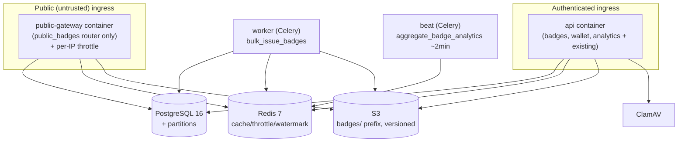

# Deployment Architecture — Badge Feature

## Container topology (Docker Compose; production analog)

### Text Alternative
Two ingress paths: a new public-gateway container (public routes only, per-IP throttled) and the
existing api container (authenticated routes). Both reach PostgreSQL, Redis, and S3; the api also uses
ClamAV. Celery worker runs bulk issuance; Celery beat runs the ~2-min analytics aggregation. All share
the same PostgreSQL (with new partitioned tables), Redis, and the S3 badges/ prefix.

## docker-compose additions (planned)
- **`public-gateway`** service: same build image; command runs the app with a PUBLIC-only router set
  (env flag e.g. `APP_ROLE=public`); published on a distinct port; env for DB/Redis/S3; no ClamAV.
- **api**: add new authenticated routers (no new service).
- **beat**: add `aggregate_badge_analytics` to the schedule.
- **worker**: gains `bulk_issue_badges` task (no service change).
- **migrate**: runs `005_badges.py`.

## Environment / config additions
- `BADGE_IMAGE_PREFIX=badges/`, `PUBLIC_BASE_URL` (for OB ids / OG urls / presigned links),
  `PUBLIC_RATE_LIMIT_PER_IP`, `OBADGE_CACHE_TTL_SECONDS`, `ANALYTICS_AGG_INTERVAL_SECONDS`,
  `PRESIGNED_URL_TTL_SECONDS`.

## Backup / DR (AVAIL-1)
- New tables covered by existing automated PostgreSQL backups; badge images covered by S3 versioning.
- DR test scenarios captured in nfr-design-patterns.md §9 (execute in Operations).

## Rollout note
- Additive migration + new container. Rollback: remove public-gateway service, revert migration
  (downgrade), remove new routes. Feature can be gated by not exposing the public-gateway ingress.
