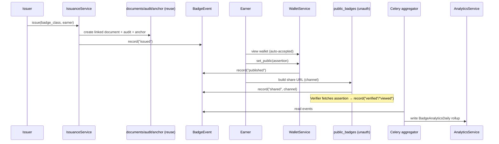

# Component Dependencies — Credly-Style Credentialing

## Dependency Matrix (new components → dependencies)

| Component | Depends on (new) | Depends on (existing/reused) |
|---|---|---|
| BadgeService | BadgeClass model | S3 client, malware scanner, RLS middleware, config |
| IssuanceService | BadgeAssertion, BadgeClass, OpenBadgesSerializer, BadgeEventService | documents/DocumentService pattern, audit, anchoring, encryption, notification task, bulk pattern |
| OpenBadgesSerializer | (none) | config (base URLs) |
| WalletService | BadgeAssertion, BadgeEventService | OTP auth identity (dependencies/auth), RLS |
| SharingService | BadgeAssertion, OpenBadgesSerializer, BadgeEventService | config (public base URL) |
| DirectoryService | BadgeClass, BadgeAssertion | RLS |
| AnalyticsService | BadgeAnalyticsDaily | RLS |
| BadgeEventService | BadgeEvent model | RLS |
| aggregate_badge_analytics (task) | BadgeEvent, BadgeAnalyticsDaily | Celery app, beat schedule |
| bulk_issue_badges (task) | IssuanceService | Celery app, bulk_jobs |
| Routers (badges/wallet/public/analytics) | respective services | auth dependency, RBAC, rate limiter, error handlers |
| Frontend pages | API endpoints | AuthContext, api client |

## Communication Patterns
- **Synchronous (in-request)**: router → service → model (RLS). Issuance reuses documents/audit/
  anchoring synchronously in one transaction (consistency), then enqueues async notification.
- **Asynchronous (Celery/Redis)**: bulk issuance; analytics aggregation (beat); notifications.
- **Public/unauthenticated**: `public_badges` router reads only `public = true` data; no writes except
  append-only view/verify events.

## Data Flow — Issue → Wallet → Publish → Share → Verify → Analytics

### Text Alternative
Issuer issues → IssuanceService creates the linked document (reusing audit/anchoring) and records an
"issued" event. Earner sees the auto-accepted badge, opts it public ("published" event), builds a
channel-tagged share URL ("shared" event). Verifiers fetch the public assertion ("verified"/"viewed").
A Celery aggregator rolls all events into the daily analytics table that AnalyticsService reads.

## Cross-cutting
- **RLS**: every new tenant-scoped table gets `tenant_id` + enable/force RLS + `tenant_isolation` policy.
- **Public safety**: unauthenticated router filters strictly on `public = true` / `directory_visible`.
- **PBT invariants** (testing extension): private-by-default, revoked-never-valid, OB serialize↔parse
  round-trip, share-URL channel preserved, tenant isolation.
