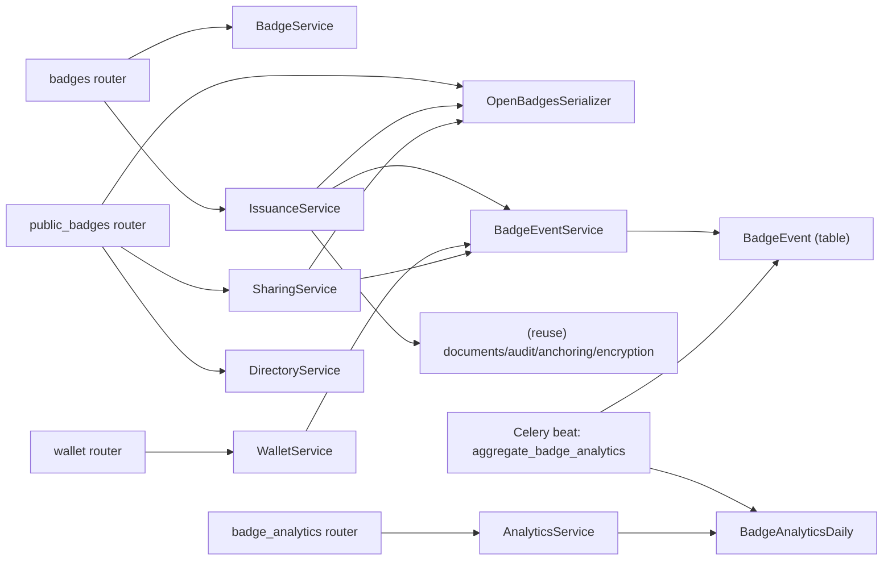

# Services & Orchestration — Credly-Style Credentialing

Follows the existing platform pattern: thin routers → service classes → SQLAlchemy models, with
`get_<service>` DI factories and `set_tenant_context` for RLS.

## Service Definitions & Responsibilities

| Service | Owns | Reuses |
|---|---|---|
| BadgeService | BadgeClass CRUD, image, issuer profile, directory toggle | S3, malware scanner, RLS |
| IssuanceService | issue/bulk/revoke, linked documents row, events | DocumentService pattern, audit, anchoring, encryption/S3, notification, BadgeEventService |
| OpenBadgesSerializer | OB 2.0 JSON (assertion/class/issuer), verification object | — (pure) |
| WalletService | wallet list, hide/delete, public opt-in, events | OTP auth identity, BadgeEventService |
| SharingService | public page data, OG meta, LinkedIn deep-link, earner profile, share URL + event | OpenBadgesSerializer, BadgeEventService |
| DirectoryService | catalog + privacy-gated earners, keyset pagination | RLS |
| AnalyticsService | read rollups (overview/per-badge/top/channels) | BadgeAnalyticsDaily |
| BadgeEventService | append BadgeEvent rows | RLS |

## Orchestration Patterns

### Issuance (IssuanceService.issue) — the central flow
1. Validate BadgeClass active + tenant-owned (RLS).
2. Create linked `documents` row (reuse existing storage/encryption/audit/anchoring) — hybrid model.
3. Create BadgeAssertion (accepted=true auto; public=false default).
4. Audit + anchor commitment (reuse).
5. `BadgeEventService.record("issued", ...)`.
6. Enqueue notification (reuse notification service/task).
7. Return assertion id + hosted assertion URL.

### Bulk issuance
- Router → `IssuanceService.bulk_issue` creates a bulk_jobs row → enqueues `bulk_issue_badges` Celery
  task → task calls `issue` per row in independent savepoints (record independence).

### Wallet opt-in (privacy)
- `WalletService.set_public(..., public=True)` flips the assertion public flag and records a
  "published" event. Private-by-default is enforced: public surfaces filter `public = true`.

### Public verification & view
- `public_badges` router (unauth) → OpenBadgesSerializer for JSON, IssuanceService.get_assertion for
  status; records "verified"/"viewed" events (async-aggregated).

### Analytics (Q3=B async)
- Write path: services call `BadgeEventService.record(...)` (cheap append).
- Aggregation: `aggregate_badge_analytics` Celery beat task rolls events into BadgeAnalyticsDaily.
- Read path: AnalyticsService queries the daily rollup (fast, scale-friendly for 10M+).

## Service Interaction Diagram

### Text Alternative
Routers delegate to their services. IssuanceService uses the serializer, reuses documents/audit/
anchoring/encryption, and records events. Wallet & Sharing also record events. All events append to
BadgeEvent; a Celery beat task aggregates them into BadgeAnalyticsDaily, which AnalyticsService reads.
