# Execution Plan — Credly-Style Credentialing

## Detailed Analysis Summary

### Transformation Scope (Brownfield)
- **Transformation Type**: Additive feature (new components alongside existing system) — NOT an architectural transformation.
- **Primary Changes**: New BadgeClass + BadgeAssertion domain, hosted Open Badges 2.0 assertions, recipient wallet, sharing surfaces, public directory, analytics.
- **Related Components**: reuses `documents` (hybrid link), audit, anchoring, encryption/S3, notifications, OTP auth, RLS, rate limiter.

### Change Impact Assessment
- **User-facing changes**: Yes — new admin (BadgeClass, analytics), earner wallet, public badge/earner pages, directory.
- **Structural changes**: Minor — new modules/routers/services; no change to existing architecture.
- **Data model changes**: Yes — new `badge_classes`, `badge_assertions` tables (+ event counters), Alembic migration, RLS policies.
- **API changes**: Yes — new endpoints for badge classes, issuance, wallet, sharing, directory, analytics, hosted assertion + issuer profile.
- **NFR impact**: Yes — 10M+ assertions/tenant (indexing/partitioning), OB 2.0 compliance, resiliency (Backup&Restore, single-region MZ), PBT.

### Component Relationships (Brownfield)
- **Primary Components**: new `badge` models/services/routers; new frontend pages.
- **Shared Components**: documents, audit, anchoring, encryption, S3, notification, auth (OTP), RLS middleware, rate limiter.
- **Dependent Components**: frontend (new pages), Celery (bulk issuance, notification, view-counter aggregation), MCP (optional future badge tools — not this increment).
- **Supporting Components**: Alembic migration, tests (unit/property/integration/smoke).

### Risk Assessment
- **Risk Level**: Medium.
- **Rollback Complexity**: Moderate — additive tables/endpoints; migration is reversible; feature is isolated from core issuance.
- **Testing Complexity**: Moderate-to-Complex — OB compliance, privacy invariants, scale; PBT extension enforced.

## Workflow Visualization

```mermaid
flowchart TD
    Start(["Credly-style feature request"])

    subgraph INCEPTION["🔵 INCEPTION PHASE"]
        WD["Workspace Detection<br/><b>COMPLETED</b>"]
        RE["Reverse Engineering<br/><b>COMPLETED</b>"]
        RA["Requirements Analysis<br/><b>COMPLETED</b>"]
        US["User Stories<br/><b>COMPLETED</b>"]
        WP["Workflow Planning<br/><b>IN PROGRESS</b>"]
        AD["Application Design<br/><b>EXECUTE</b>"]
        UG["Units Generation<br/><b>EXECUTE</b>"]
    end

    subgraph CONSTRUCTION["🟢 CONSTRUCTION PHASE"]
        FD["Functional Design<br/><b>EXECUTE (per unit)</b>"]
        NFRA["NFR Requirements<br/><b>EXECUTE (per unit)</b>"]
        NFRD["NFR Design<br/><b>EXECUTE (per unit)</b>"]
        ID["Infrastructure Design<br/><b>EXECUTE (per unit)</b>"]
        CG["Code Generation<br/><b>EXECUTE</b>"]
        BT["Build and Test<br/><b>EXECUTE</b>"]
    end

    subgraph OPERATIONS["🟡 OPERATIONS PHASE"]
        OPS["Operations<br/><b>PLACEHOLDER</b>"]
    end

    Start --> WD --> RE --> RA --> US --> WP --> AD --> UG
    UG --> FD --> NFRA --> NFRD --> ID --> CG --> BT --> End(["Complete"])
    BT -.-> OPS

    style WD fill:#4CAF50,stroke:#1B5E20,stroke-width:3px,color:#fff
    style RE fill:#4CAF50,stroke:#1B5E20,stroke-width:3px,color:#fff
    style RA fill:#4CAF50,stroke:#1B5E20,stroke-width:3px,color:#fff
    style US fill:#4CAF50,stroke:#1B5E20,stroke-width:3px,color:#fff
    style WP fill:#4CAF50,stroke:#1B5E20,stroke-width:3px,color:#fff
    style AD fill:#FFA726,stroke:#E65100,stroke-width:3px,stroke-dasharray: 5 5,color:#000
    style UG fill:#FFA726,stroke:#E65100,stroke-width:3px,stroke-dasharray: 5 5,color:#000
    style FD fill:#FFA726,stroke:#E65100,stroke-width:3px,stroke-dasharray: 5 5,color:#000
    style NFRA fill:#FFA726,stroke:#E65100,stroke-width:3px,stroke-dasharray: 5 5,color:#000
    style NFRD fill:#FFA726,stroke:#E65100,stroke-width:3px,stroke-dasharray: 5 5,color:#000
    style ID fill:#FFA726,stroke:#E65100,stroke-width:3px,stroke-dasharray: 5 5,color:#000
    style CG fill:#4CAF50,stroke:#1B5E20,stroke-width:3px,color:#fff
    style BT fill:#4CAF50,stroke:#1B5E20,stroke-width:3px,color:#fff
    style OPS fill:#BDBDBD,stroke:#424242,stroke-width:2px,stroke-dasharray: 5 5,color:#000
    style INCEPTION fill:#BBDEFB,stroke:#1565C0,stroke-width:3px,color:#000
    style CONSTRUCTION fill:#C8E6C9,stroke:#2E7D32,stroke-width:3px,color:#000
    style OPERATIONS fill:#FFF59D,stroke:#F57F17,stroke-width:3px,color:#000
    style Start fill:#CE93D8,stroke:#6A1B9A,stroke-width:3px,color:#000
    style End fill:#CE93D8,stroke:#6A1B9A,stroke-width:3px,color:#000
    linkStyle default stroke:#333,stroke-width:2px
```

### Text Alternative
Completed: Workspace Detection, Reverse Engineering, Requirements Analysis, User Stories. In progress:
Workflow Planning. To execute: Application Design → Units Generation → (per-unit) Functional Design →
NFR Requirements → NFR Design → Infrastructure Design → Code Generation → Build and Test. Operations is
a placeholder.

## Phases to Execute

### 🔵 INCEPTION PHASE
- [x] Workspace Detection (COMPLETED)
- [x] Reverse Engineering (COMPLETED)
- [x] Requirements Analysis (COMPLETED)
- [x] User Stories (COMPLETED)
- [x] Execution Plan (IN PROGRESS)
- [ ] Application Design — **EXECUTE**
  - **Rationale**: New components/services (BadgeService, WalletService, SharingService, DirectoryService, AnalyticsService), new routers, and component boundaries need definition.
- [ ] Units Generation — **EXECUTE**
  - **Rationale**: New data models + multiple sub-areas (badges/issuance, wallet, sharing/directory, analytics) benefit from decomposition into units of work with a dependency order.

### 🟢 CONSTRUCTION PHASE (per unit)
- [ ] Functional Design — **EXECUTE**
  - **Rationale**: Non-trivial business logic (OB 2.0 assertion generation, baking, privacy gating, analytics counters). PBT-01 property identification is mandatory here (testing extension enabled).
- [ ] NFR Requirements — **EXECUTE**
  - **Rationale**: Scale (10M+/tenant), OB compliance, resiliency targets; confirm Hypothesis as PBT framework (PBT-09).
- [ ] NFR Design — **EXECUTE**
  - **Rationale**: Indexing/partitioning design for assertions, resiliency incorporation (Backup&Restore), propose lightweight incident response (RESILIENCY-15).
- [ ] Infrastructure Design — **EXECUTE**
  - **Rationale**: New S3 prefix for badge images, public endpoint exposure, backup coverage for new tables/objects. Lighter scope but applicable.
- [ ] Code Generation — **EXECUTE (ALWAYS)**
  - **Rationale**: Implement models, migration, services, routers, tasks, frontend, and tests.
- [ ] Build and Test — **EXECUTE (ALWAYS)**
  - **Rationale**: Build, run unit/property/integration tests, verify OB compliance and invariants.

### 🟡 OPERATIONS PHASE
- [ ] Operations — PLACEHOLDER

## Proposed Units of Work (finalized in Units Generation)
1. **U1 — Badge Core** (BadgeClass, BadgeAssertion models, migration, RLS, issuance, hosted OB 2.0 assertion + issuer profile, baking, revocation). Foundation for all others.
2. **U2 — Recipient Wallet** (OTP-based wallet, auto-accept, hide/delete, privacy toggle). Depends on U1.
3. **U3 — Sharing & Directory** (public pages, Open Graph, LinkedIn deep-link, earner profile, per-tenant directory with privacy gating). Depends on U1, U2.
4. **U4 — Analytics** (event counters, dashboard metrics, channel breakdown). Depends on U1-U3 events.

**Dependency order**: U1 → U2 → U3 → U4 (largely sequential; some U3/U4 frontend can parallelize after U1).

## Estimated Timeline
- **Total stages to execute**: 2 inception (App Design, Units) + 6 construction (x per unit where applicable) + Build & Test.
- **Estimated duration**: Multi-session; U1 is the largest. Each unit gated for your approval.

## Success Criteria
- **Primary Goal**: Standards-compliant Open Badges issuing + wallet + sharing + directory + analytics, integrated with existing platform.
- **Key Deliverables**: new tables/migration, badge services/routers, hosted assertions + issuer profile, wallet & public UIs, analytics, tests (example + PBT).
- **Quality Gates**: OB 2.0 validator passes; privacy-by-default & revocation invariants hold (PBT); tenant isolation preserved; build + tests green.
- **Integration Testing**: badge issuance ↔ documents/audit/anchoring; wallet ↔ OTP auth; public endpoints expose only opted-public data.
- **Operational Readiness**: backups cover new tables/objects; lightweight IR proposed.
