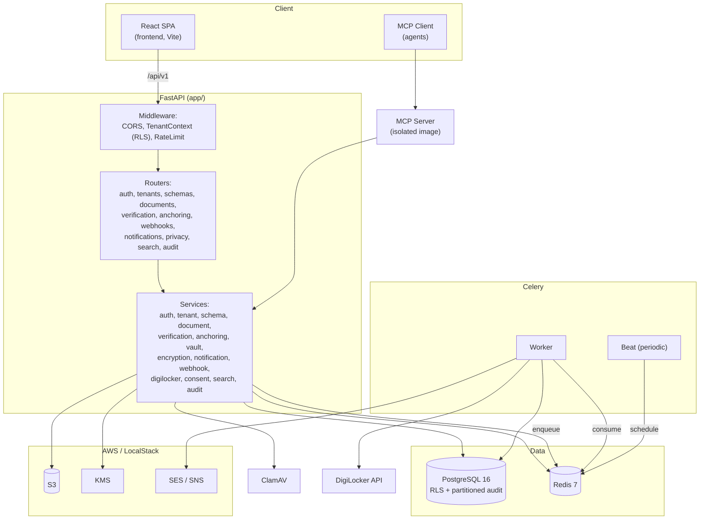
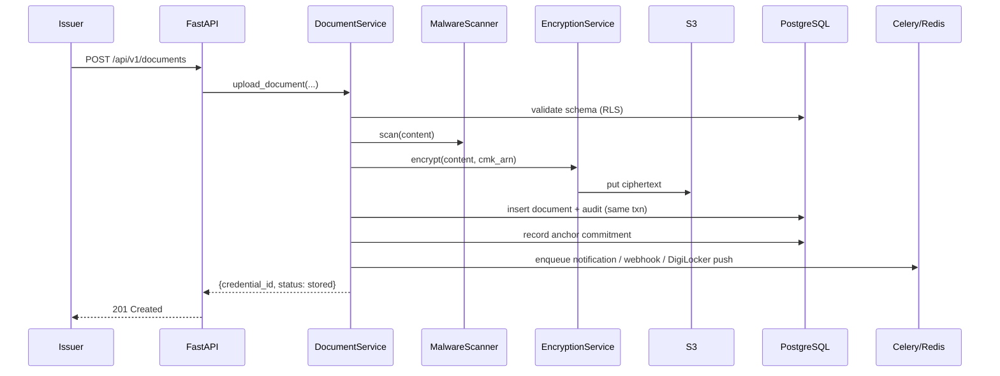

# System Architecture

## System Overview

Repo SaaS is an async Python **FastAPI** service backed by **PostgreSQL 16** (with Row-Level Security for tenant isolation), **Redis 7** (cache, rate-limiting, Celery broker), and **AWS S3/KMS/SES/SNS** (via LocalStack in dev). Background work runs on **Celery** (worker + beat). A **React/Vite/TypeScript** SPA is the admin/tenant UI. A separate, isolated **MCP server** image exposes platform operations as agent tools. Everything is orchestrated with **Docker Compose**.

## Architecture Diagram

### Text Alternative
- The React SPA calls the FastAPI service under `/api/v1`, passing through CORS → TenantContext (sets RLS `app.tenant_id`) → RateLimit middleware, then routers, then services.
- Services read/write PostgreSQL (RLS-enforced) and Redis, call S3/KMS/ClamAV synchronously, and enqueue Celery jobs on Redis.
- Celery worker consumes jobs and calls SES/SNS (notifications), DigiLocker (push), and PostgreSQL; Celery beat schedules periodic tasks (anomaly sweep, retention, anchoring batch).
- A separate MCP server image calls the same service layer for agent-driven operations.

## Component Descriptions

### app/ (FastAPI application) — Type: Application
- **Purpose**: HTTP API for all platform operations.
- **Responsibilities**: Routing, request validation, auth/RBAC, tenant-context middleware, error handling, OpenAPI.
- **Dependencies**: PostgreSQL, Redis, S3, KMS, ClamAV.

### app/services/ — Type: Application (domain logic)
- **Purpose**: Business logic, one service class per domain.
- **Responsibilities**: Encapsulate rules; enforce tenant context; orchestrate encryption, storage, audit, events.

### app/tasks/ (Celery) — Type: Application (async)
- **Purpose**: Background processing.
- **Responsibilities**: Bulk upload, notifications, webhooks, DigiLocker push, anomaly detection, retention, anchoring batch sweep.

### frontend/ — Type: Application (UI)
- **Purpose**: Admin/tenant/issuer web UI.
- **Responsibilities**: Login (OAuth2 + dev preview), tenants admin, documents (upload/revoke/DigiLocker push), schemas, webhooks.

### app/mcp/ — Type: Application (integration)
- **Purpose**: Model Context Protocol server exposing platform ops as agent tools.
- **Responsibilities**: 6 stdio tools wrapping the service layer; isolated dependency environment.

### alembic/ — Type: Infrastructure (schema migrations)
- **Purpose**: Database schema evolution.
- **Responsibilities**: Tables, RLS policies, triggers, partitions, extensions.

## Data Flow — Document Issuance (key workflow)

### Text Alternative
Issuer POSTs a document → service validates schema under RLS → malware scan → encrypt (KMS envelope) → store ciphertext in S3 → insert metadata + audit row in one transaction → record anchor commitment → enqueue async notification/webhook/DigiLocker → return credential_id.

## Integration Points
- **External APIs**: DigiLocker Issuer API (async push, OAuth2 authorization-code flow — placeholder URL in dev).
- **Databases**: PostgreSQL 16 (primary, RLS), Redis 7 (cache/broker/rate-limit).
- **Third-party Services**: AWS KMS (envelope encryption), AWS S3 (ciphertext at rest), AWS SES (email), AWS SNS (SMS), ClamAV (malware scanning), optional EVM chain (anchoring).

## Infrastructure Components
- **Orchestration**: Docker Compose (`docker-compose.yml`) — postgres, redis, localstack, clamav, api, worker, beat, migrate (profile), mcp (profile). Test variant in `docker-compose.test.yml`.
- **Images (Dockerfile stages)**: `base`, `dev` (ruff/pytest/mypy), `production`, `worker`, `beat`, `mcp`.
- **Deployment Model**: Containerized microservice-style single service + workers; dev uses LocalStack for AWS.
- **Networking**: Compose default network; service hostnames (postgres, redis, localstack, clamav).
