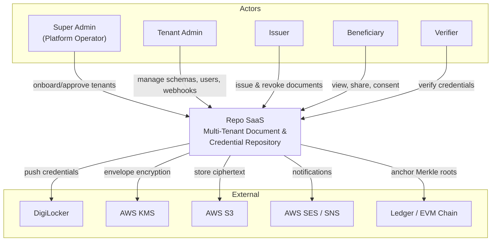

# Business Overview

## Business Context Diagram

### Text Alternative
- Five human/role actors interact with the platform: Super Admin, Tenant Admin, Issuer, Beneficiary, Verifier.
- The platform integrates with five external services: DigiLocker (credential delivery), AWS KMS (key management), AWS S3 (encrypted storage), AWS SES/SNS (email/SMS), and a ledger/EVM chain (tamper-evident anchoring).

## Business Description

- **Business Description**: Repo SaaS is a **generic, domain-agnostic, multi-tenant digital depository**. Organizations (government departments, institutions, regulatory bodies) onboard as tenants, define their own document/credential schemas, issue structured credential records to beneficiaries, and let third parties verify authenticity. It provides secure storage (per-tenant envelope encryption), verifiable issuance, consent-driven sharing, tamper-evident anchoring, and optional delivery to DigiLocker.

- **Business Transactions**:
  1. **Tenant onboarding & lifecycle** — create (pending) → approve (active) → suspend → deactivate; API key rotation with grace period.
  2. **Schema definition & versioning** — create/update document schemas with field definitions; breaking-change detection; version history; JSON export.
  3. **Document issuance** — single and bulk upload; malware scan → encrypt → store → audit → anchor → notify → optional DigiLocker push.
  4. **Document retrieval & download** — beneficiary/issuer retrieval; signed PDF / JSON-LD rendering with QR code.
  5. **Revocation** — single and bulk revoke with reason; beneficiary notification.
  6. **Verification** — consent-scoped token verification; public validity check; QR verification page.
  7. **Consent & data-principal rights** — consent capture with notice version; erasure requests (DPDP-aligned).
  8. **Anchoring** — batch credential commitments into a Merkle tree; publish root to local ledger or EVM chain.
  9. **Notifications** — issuance/revocation/verification alerts via email/SMS, preference-driven.
  10. **Webhooks** — tenant-registered endpoints receive signed event callbacks.
  11. **Audit & search** — immutable audit trail; per-tenant faceted document search.
  12. **DigiLocker push** — asynchronous delivery of issued credentials to beneficiary DigiLocker accounts.

- **Business Dictionary**:
  - **Tenant** — an onboarded organization with an isolated namespace.
  - **Credential / Document** — an issued, encrypted record identified by a `credential_id`.
  - **Schema** — a versioned definition of the fields a document must contain.
  - **Beneficiary** — the subject/holder a document is issued to.
  - **Issuer** — a role that creates and revokes documents within a tenant.
  - **Verifier** — a third party who checks credential validity.
  - **Anchoring** — recording a cryptographic commitment of a credential into a tamper-evident ledger.
  - **Consent** — a recorded agreement governing which fields may be shared and for how long.
  - **Verification token** — a single-use, expiring token granting consent-scoped read of specified fields.

## Component Level Business Descriptions

### Tenant Service
- **Purpose**: Onboard and govern tenant organizations.
- **Responsibilities**: Lifecycle state machine, namespace/domain uniqueness, quota & rate-limit config, KMS key provisioning, API key rotation.

### Schema Service
- **Purpose**: Let tenants define the shape of their credentials.
- **Responsibilities**: Field validation, version increments, breaking-change detection, export.

### Document Service
- **Purpose**: Core issuance/retrieval/revocation pipeline.
- **Responsibilities**: Validation, malware scan, encryption, S3 storage, audit, event dispatch, rendering.

### Verification Service
- **Purpose**: Consent-scoped and public credential verification.
- **Responsibilities**: Token generation/consumption (single-use), public validity checks, field redaction.

### Anchoring Service
- **Purpose**: Provide tamper-evidence for issued credentials.
- **Responsibilities**: Canonical leaf hashing, Merkle batching, local ledger or EVM publication, inclusion proofs.

### Vault Service
- **Purpose**: Field-level PII protection.
- **Responsibilities**: Seal/open PII fields, per-tenant key derivation, blind indexes for searchable encryption.

### Notification / Webhook / DigiLocker connectors
- **Purpose**: Outbound integrations.
- **Responsibilities**: Preference-driven notifications (SES/SNS), signed webhook delivery with retry, async DigiLocker push with retry.

### Supporting services
- **Auth Service** (OAuth2 client credentials, OTP, MFA, lockout), **Audit Service** (append-only immutable log), **Search Service** (pg_trgm faceted search), **Consent Service** (DPDP consent/erasure), **Rate Limiter** (per-tenant Redis sliding window), **Malware Scanner** (ClamAV/GuardDuty), **Encryption Service** (KMS envelope AES-256-GCM).
