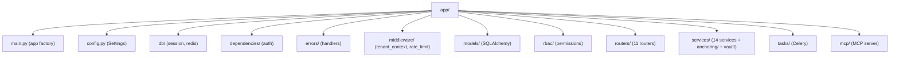

# Code Structure

## Build System
- **Backend**: `pyproject.toml` (setuptools), Python 3.12. Core deps + `[dev]` (pytest, ruff, mypy, hypothesis) + `[mcp]` (mcp SDK) extras. Console script `repo-saas-mcp`.
- **Frontend**: `frontend/package.json` (npm), Vite + React 18 + TypeScript + Tailwind.
- **Migrations**: Alembic (`alembic.ini`, `alembic/`).
- **Orchestration**: Docker Compose; multi-stage `Dockerfile`.
- **CI**: `.github/workflows/ci.yml`.

## Module Hierarchy

### Text Alternative
`app/` contains: main.py (app factory), config.py (Pydantic Settings), db/ (async session + redis), dependencies/ (JWT auth), errors/ (exception handlers), middleware/ (tenant RLS context, rate limit), models/ (SQLAlchemy models), rbac/ (permission map), routers/ (11 domain routers), services/ (14 service modules plus anchoring/ and vault/ subpackages), tasks/ (Celery app + task modules), mcp/ (MCP server).

### Existing Files Inventory (candidates for modification)
- `app/main.py` — FastAPI app factory, router wiring, health check.
- `app/config.py` — Pydantic `BaseSettings`; all env vars and bounds validation.
- `app/db/session.py` — async engine, `AsyncSessionLocal`, `get_db`.
- `app/db/redis.py` — Redis client + tenant status caching helpers.
- `app/middleware/tenant_context.py` — sets `app.tenant_id` (RLS); suspension/deactivation guards.
- `app/middleware/rate_limit.py` — per-tenant sliding-window rate limiting.
- `app/dependencies/auth.py` — `get_current_user`, JWT validation, `TokenPayload`.
- `app/rbac/permissions.py` — `ROLE_PERMISSIONS`, `require_permission`.
- `app/errors/handlers.py` — global exception handlers (422/HTTP/500).
- `app/models/*.py` — tenant, user, schema, document, verification, audit, webhook, notification, digilocker, anchor, consent, base.
- `app/routers/*.py` — auth, tenants, schemas, documents, verification, anchoring, webhooks, notifications, privacy, search, audit.
- `app/services/*.py` — auth, tenant, schema, document, verification, encryption, notification, webhook, digilocker_connector, malware_scanner, rate_limiter, search, consent, audit; plus `anchoring/` and `vault/` subpackages.
- `app/tasks/*.py` — celery_app, bulk_upload, notifications, webhooks, digilocker, anomaly_detection, retention, anchoring, dispatch.
- `app/mcp/*.py` — server, __main__, __init__.
- `alembic/versions/00{1..4}_*.py` — initial schema, RLS bootstrap, webhook sealed secret, anchoring & consent.
- `frontend/src/**` — App, pages (admin/tenant), components, context (AuthContext), hooks, lib.

## Design Patterns
### Application Factory
- **Location**: `app/main.py` (`create_app()`).
- **Purpose**: Isolated app instances for tests and clean lifespan management.

### Dependency Injection (FastAPI Depends)
- **Location**: routers, `dependencies/auth.py`, service `get_<service>` factories.
- **Purpose**: Wire DB sessions, auth, RBAC, services.

### Service Layer
- **Location**: `app/services/`.
- **Purpose**: Encapsulate domain logic; keep routers thin.

### Row-Level Security (tenant isolation)
- **Location**: migrations + `middleware/tenant_context.py` + `set_tenant_context`.
- **Purpose**: DB-enforced multi-tenancy below the ORM.

### Transactional Outbox (audit)
- **Location**: `document_service` + `audit_service`.
- **Purpose**: Audit row written in the same transaction as the operation.

### Envelope Encryption
- **Location**: `encryption_service`, `vault/`.
- **Purpose**: Per-tenant KMS-wrapped DEKs; AES-256-GCM content encryption.

### Provider/Strategy (anchoring, vault)
- **Location**: `services/anchoring/providers.py`, `services/vault/providers.py`.
- **Purpose**: Swap local vs EVM anchoring; local vs KMS vault.

## Critical Dependencies
### FastAPI 0.111.0
- **Usage**: Web framework, DI, OpenAPI. Pins `starlette<0.38`.
### SQLAlchemy 2.0.30 (async) + asyncpg
- **Usage**: ORM and async DB access; psycopg2 used for Alembic migrations.
### Pydantic 2.7.1 / pydantic-settings 2.2.1
- **Usage**: Request models and configuration. Note: pinned; the MCP image intentionally diverges to pydantic ≥2.10.
### Celery 5.4.0 (redis)
- **Usage**: Async task queue; app referenced as `app.tasks.celery_app:celery_app`.
### python-jose, passlib[bcrypt], pyotp, cryptography
- **Usage**: RS256 JWT, password/secret hashing, TOTP MFA, AES-GCM.
