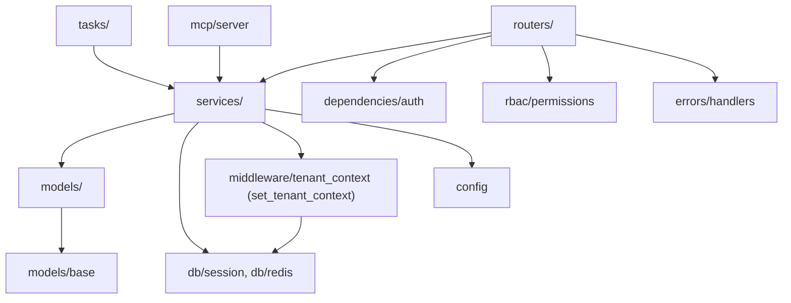

# Dependencies

## Internal Dependencies

### Text Alternative
Routers depend on services, auth dependency, and RBAC. Services depend on models, db (session/redis), tenant-context helper, and config. Celery tasks and the MCP server both depend on services. Middleware depends on db. Models depend on the declarative base.

### Key relationships
- **routers → services**: Type Runtime — routers delegate all business logic to service classes.
- **services → models**: Type Runtime — persistence via SQLAlchemy models.
- **services → middleware.set_tenant_context**: Type Runtime — every tenant-scoped query sets RLS context.
- **tasks → services**: Type Runtime — Celery tasks reuse service logic.
- **mcp → services**: Type Runtime — MCP tools call the same services (isolated dependency env).
- **alembic → models**: Type Build/DDL — migrations define the schema the models map to.

## External Dependencies (selected)
### FastAPI 0.111.0
- **Purpose**: HTTP framework. **License**: MIT. **Note**: constrains `starlette<0.38`.
### SQLAlchemy 2.0.30 / asyncpg 0.29.0
- **Purpose**: async ORM + Postgres driver. **License**: MIT / Apache-2.0.
### Pydantic 2.7.1 / pydantic-settings 2.2.1
- **Purpose**: models/config. **License**: MIT. **Conflict note**: mcp SDK needs pydantic ≥2.10 → resolved by isolating the MCP image (not installed into api/worker).
### Celery 5.4.0
- **Purpose**: task queue. **License**: BSD.
### boto3 1.34.102
- **Purpose**: AWS (S3/KMS/SES/SNS). **License**: Apache-2.0.
### cryptography 42.0.7 / python-jose 3.3.0 / passlib 1.7.4 / pyotp 2.9.0
- **Purpose**: encryption, JWT, hashing, TOTP. **License**: Apache-2.0/BSD/BSD/MIT.
### weasyprint 62.3 / reportlab 4.2.0 / pyld 2.0.4 / qrcode 7.4.2
- **Purpose**: document rendering. **License**: BSD/BSD/BSD/BSD.
### mcp (≥1.2,<2)
- **Purpose**: Model Context Protocol SDK. **License**: MIT. **Scope**: MCP image only.

## Known Version Constraints / Risks
- **pydantic pinning**: core app pinned at 2.7.1; MCP image diverges to ≥2.10. Kept isolated to avoid breaking the pinned stack.
- **Debian package name drift**: `libgdk-pixbuf-2.0-0` (Trixie) required a Dockerfile fix from the older `libgdk-pixbuf2.0-0`.
